# ?? Architecture Diagrams

> Visual representation of Dialogue System architecture

---

## ??? Module Dependencies

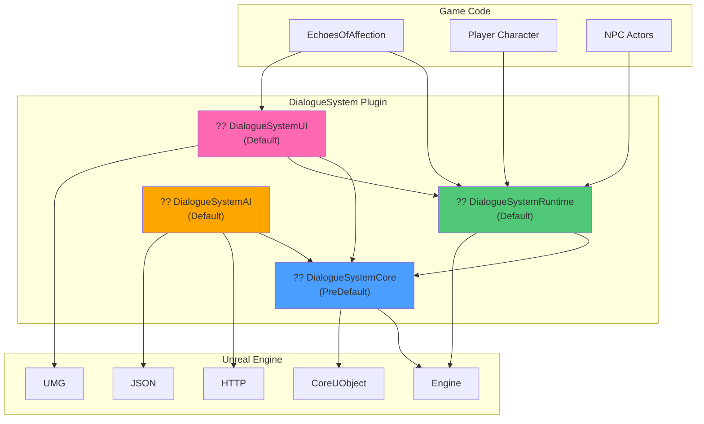

---

## ?? Complete Dialogue Flow

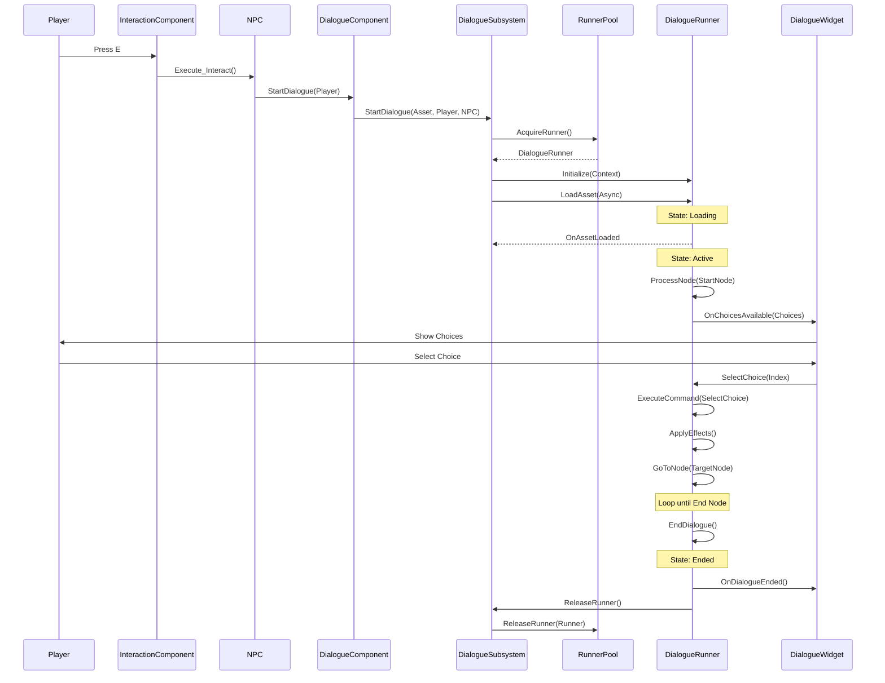

---

## ?? Class Hierarchy: Core Components

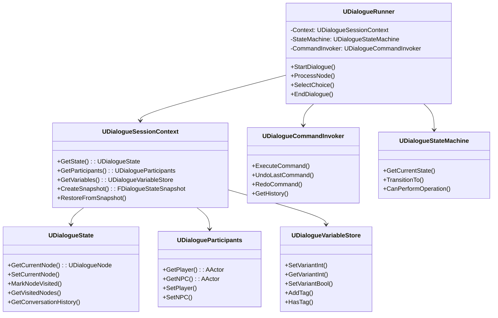

---

## ?? Command Pattern Flow

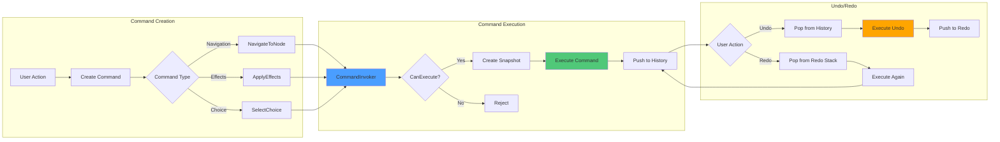

---

## ?? State Machine Transitions

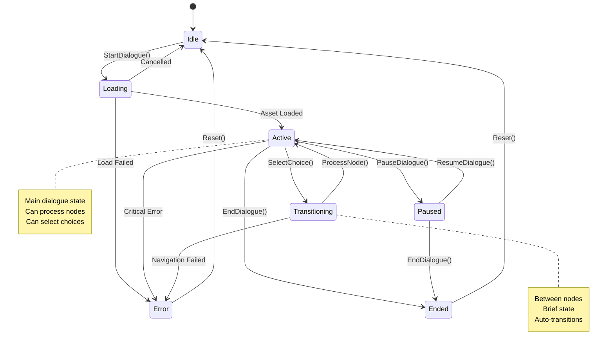

---

## ?? System Integration Map

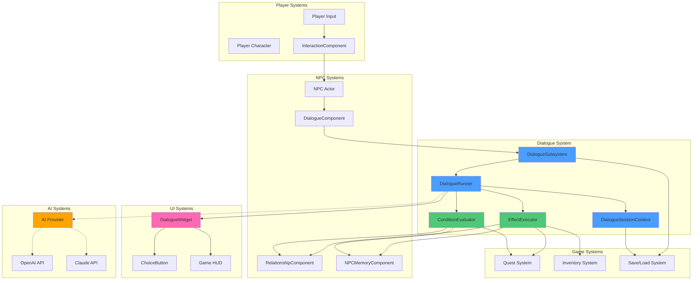

---

## ?? Effect Application Flow

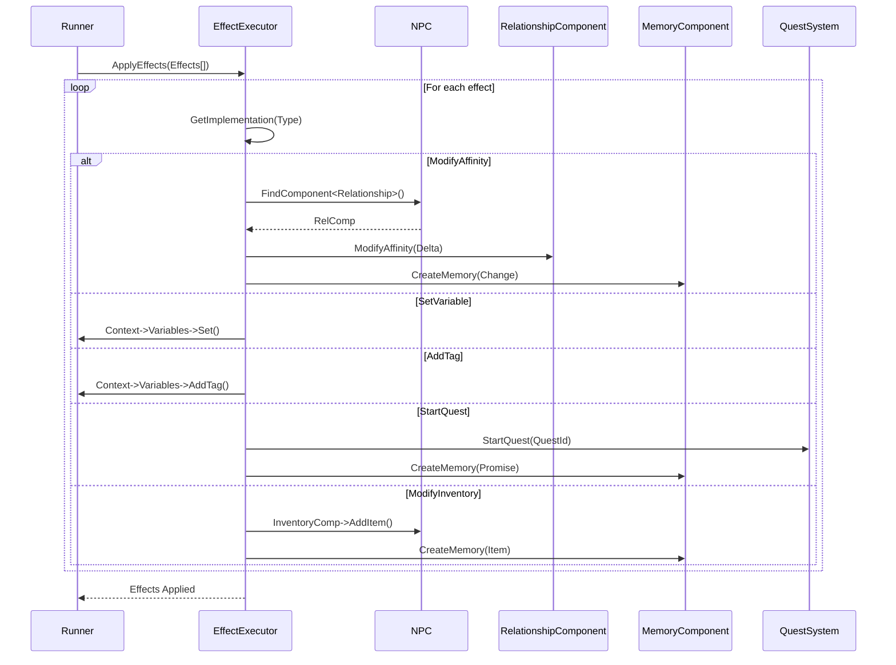

---

## ?? Memory System Architecture

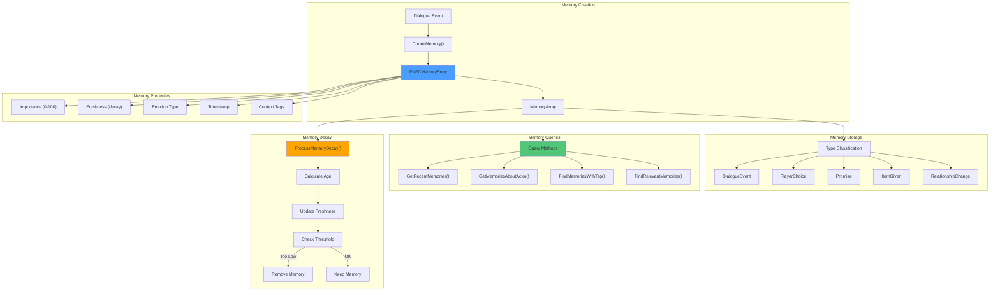

---

## ?? Relationship System Flow

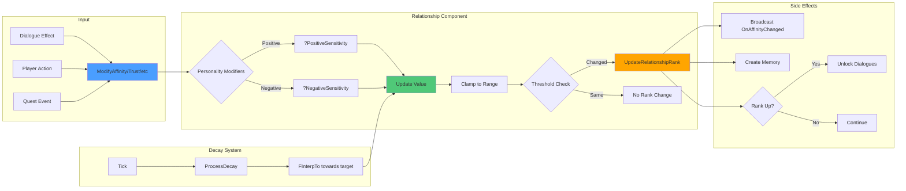

---

## ?? Object Pooling Flow

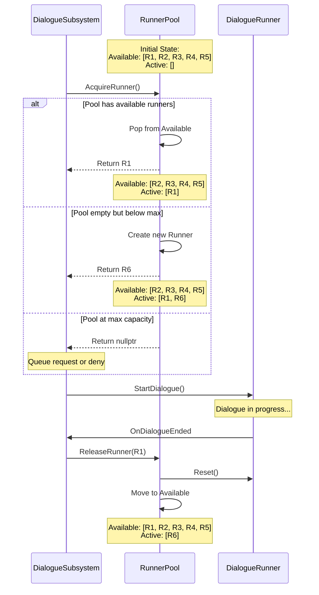

---

## ?? Condition Evaluation Tree

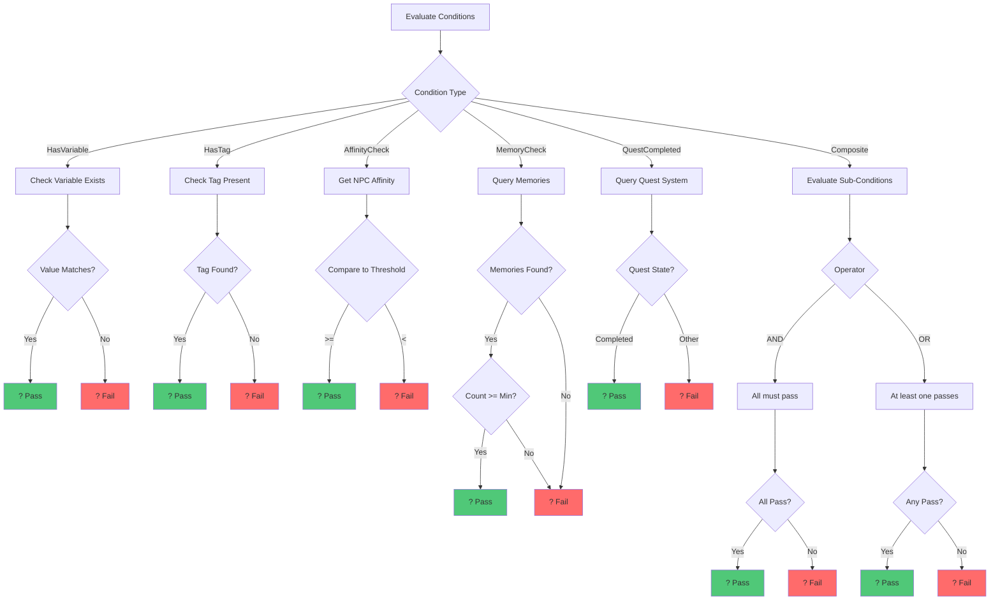

---

## ?? Performance Optimization Layers

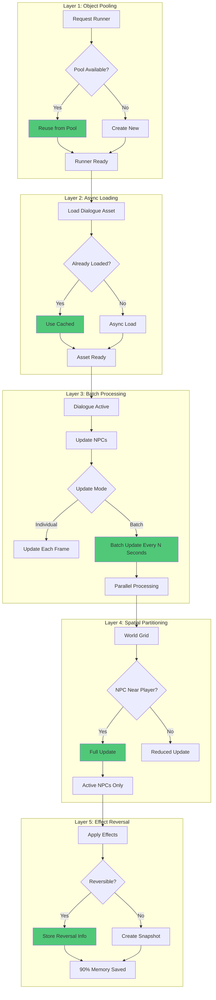

---

## ?? AI Integration Architecture (v1.5)

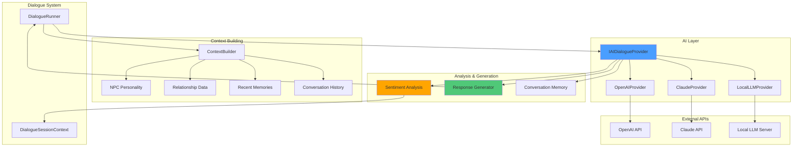

---

## ?? Scalability Roadmap

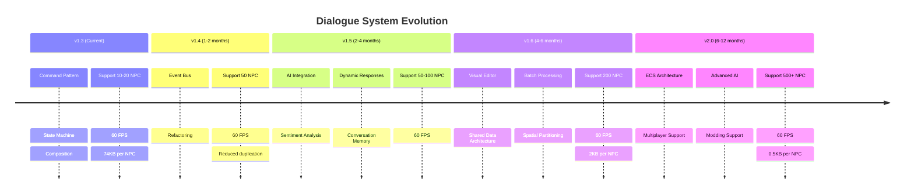

---

**Документ обновлён:** 2025-01-23  
**Версия:** 1.0  
**Инструмент:** Mermaid diagrams

*Все диаграммы можно рендерить в GitHub, GitLab, VS Code (с расширением), или на mermaid.live*
